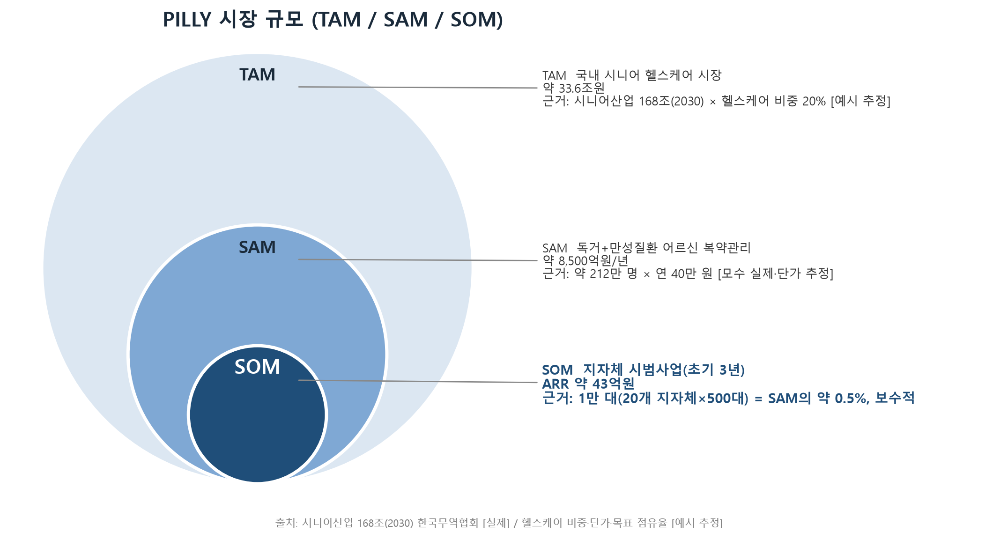
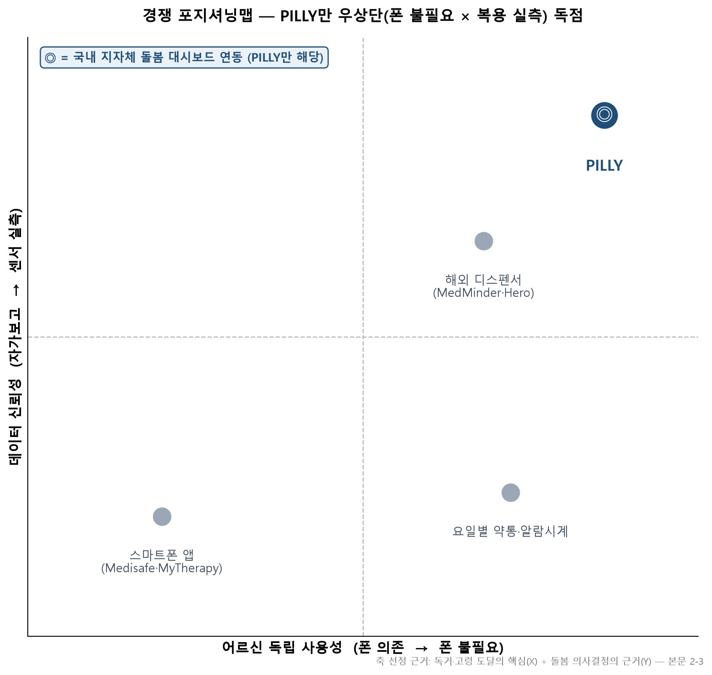

# bizplan — 정부지원사업 사업계획서 스킬

> 정부지원사업 사업계획서를 **작성·검토·발표 준비**까지 단계별로 돕는 한국어 Claude Code 스킬 15종. (GitHub 저장소 설명용 한 줄: *"정부지원사업 사업계획서 작성·검토·발표를 돕는 한국어 Claude Code 스킬 모음 — PSST 프레임워크 기반"*)

**PSST(Problem-Solution-Scale-Team)** 프레임워크를 기반으로, 막연한 아이디어를 심사위원이 납득하는 사업계획서로 다듬는다.

- 대상 사업: 예비창업패키지, 청년창업사관학교(청창사), U300, 로컬크리에이터, 수출바우처 등
- 모든 스킬은 한국어로 안내한다.
- 지원사업마다 양식·금액·기간이 다르므로, 각 스킬은 먼저 **어떤 지원사업·양식 대상인지 확인**하고 예산·기간을 해당 공고 기준으로 조정한다. (기본값 예시: 예창패 1단계 2천만 + 2단계 4천만, 8개월)

## 스킬 목록

| 스킬 | 용도 | 이럴 때 |
|------|------|---------|
| `bizplan` | 라우터 | "사업계획서 도와줘"처럼 막연할 때. 상황을 물어 알맞은 모드로 안내 |
| `bizplan-quick` | 간략 모드 | 4가지(업종·타겟·핵심기능·차별점)만 답하고 PSST 전체 초안을 한 번에 |
| `bizplan-item` | ① 아이템 구체화 | 아이디어만 있음. 아이템명·문제·솔루션·차별점·페르소나 도출 |
| `bizplan-problem` | ② 문제 인식 (P) | SPIN 기법으로 Pain Point 설득, "배경 및 필요성" 작성 |
| `bizplan-research` | ③ 시장·고객·경쟁 조사 | 시장 규모, 타겟 고객·페르소나, 경쟁사 비교 분석 |
| `bizplan-solution` | ④ 실현 가능성 (S) | 기술 구현 계획, 예산 계획(1·2단계), 추진 일정표 |
| `bizplan-growth` | ⑤ 성장 전략 (S) | 비즈니스 모델·마케팅, SWOT, BM 구성도 |
| `bizplan-team` | ⑥ 팀 구성 (T) | 대표자 역량, 팀 현황, 협력 기관 |
| `bizplan-summary` | ⑦ 개요·마무리 | 개요 요약, 기업명·스토리텔링 |
| `bizplan-visual` | 시각자료 모드 | 사업계획서에 넣을 그래프·도식·표 구성안 제안 및 제작 지원(matplotlib 그래프, 냅킨AI 인포그래픽 텍스트, 포지셔닝맵·BM구성도 스케치) |
| `bizplan-review` | ⑧ 심사위원 검토 | 초안 완성 후 점수·강약점·예상 질문, 데이터 신뢰도 검증 |
| `bizplan-pitch` | 발표(피칭) 준비 | 발표 슬라이드 구성안, 스토리텔링, 예상 질문·모범 답변 |
| `bizplan-slides` | 발표 슬라이드 제작 | HTML 슬라이드(16:9) 생성 + 레이아웃·콘텐츠 검증 |
| `bizplan-export` | 수출바우처 | 수출바우처 종합 구성, 목표시장 분석 |
| `bizplan-analyze` | 벤치마킹 분석 | 남의 계획서·합격 사례 비교 분석, 작성 공식 도출 |

## 설치 방법

### ① 로컬 스킬로 설치 (가장 간단)

**Step 1.** 이 저장소를 내려받는다 — GitHub에서 `Code → Download ZIP`, 또는:

```bash
git clone <이 저장소 주소>
```

**Step 2.** `skills/` 아래 폴더 15개를 사용자 스킬 디렉터리에 복사한다.

```bash
# macOS / Linux
cp -r skills/* ~/.claude/skills/
```

```powershell
# Windows PowerShell
Copy-Item -Recurse skills\* $HOME\.claude\skills\
```

원본을 수정하며 쓸 계획이면 복사 대신 **정션/심링크**로 연결한다 (수정이 즉시 반영됨):

```powershell
# Windows PowerShell — skills 하위 15개 폴더를 정션으로 연결
Get-ChildItem .\skills -Directory | ForEach-Object {
  New-Item -ItemType Junction -Path "$HOME\.claude\skills\$($_.Name)" -Target $_.FullName
}
```

**Step 3.** Claude Code를 재시작한다.

**Step 4. 설치 확인** — 아무 폴더에서 Claude Code를 열고 `/bizplan`를 입력했을 때 라우터 스킬이 실행되면 성공.

### ② 플러그인으로 설치 (마켓플레이스)

```
/plugin marketplace add jhsoo0211/bussiness-planner-skills
/plugin install bizplan@bussiness-planner-skills
```

설치 후 `skills/` 안의 15개 스킬이 자동 등록되고 `/bizplan`, `/bizplan-review` 등으로 호출된다. 업데이트는 `/plugin marketplace update`.

## 빠른 시작 (스텝 바이 스텝)

**Step 1.** Claude Code에 이렇게 말한다 (공고문 파일이 있으면 함께 첨부):

> 예비창업패키지 사업계획서 쓰고 싶어. 아이템은 시니어용 복약관리 약통이야.

**Step 2.** 라우터(`bizplan`)가 시작 질문을 한다:
- 어떤 지원사업·공모전인지 (평가 기준표/배점표가 있으면 첨부 요청)
- 진행 단계 — 아이디어만 / 특정 섹션 작성 중 / 초안 완성
- **빠른 버전**(전체 초안 한 번에) vs **꼼꼼 버전**(조사 포함 단계별, 오래 걸림) vs 특정 섹션만

> 질문에 답하기 어려우면 아이디어 메모·파일만 던져도 된다 — 스킬이 기획 요약 초안을 먼저 만들어 "이런 기획이 맞나요?"라고 확인받고 시작한다.

**Step 3.** 선택한 모드가 실행된다. 예를 들어 빠른 버전이면 `bizplan-quick`이 5가지(업종·타겟·핵심기능·차별점·단점)만 묻고 PSST 전체 초안 + 문제-솔루션 1:1 자체 점검표를 만든다.

**Step 4.** 초안이 나오면 검토를 돌린다:

> 심사위원처럼 점수 매기고 피드백해줘

`bizplan-review`가 배점 항목별 득점표, 9대 체크포인트(O/△/X), 약점별 "더 나은 방향", 데이터 신뢰도 검증, 예상 질문까지 제공한다. 출력 예시: [examples/예시-검토리포트-PILLY.md](examples/예시-검토리포트-PILLY.md)

**Step 5.** 발표 심사가 있으면:

> 발표 준비해줘. 발표 7분 + 질의응답 10분이야.

`bizplan-pitch`가 발표 흐름(대회 성격별 조정) → 슬라이드 구성안(슬라이드별 유도 질문 포함) → 장점 30초 답변·약점 방어 → 예상 질문을 만든다.

## 한 줄 사용 예시

- "예비창업패키지 사업계획서 쓰고 싶은데 뭐부터 해야 할지 모르겠어" → `bizplan`(라우터)
- "AI 반려동물 건강관리 앱 아이디어를 구체화해줘" → `bizplan-item`
- "문제 인식 파트를 심사위원이 납득하게 써줘" → `bizplan-problem`
- "이 시장 규모랑 경쟁사 좀 조사해줘" → `bizplan-research`
- "예산 계획이랑 8개월 추진 일정 만들어줘" → `bizplan-solution`
- "TAM SAM SOM 도식이랑 시장 그래프 만들어줘" → `bizplan-visual`
- "초안 다 썼는데 심사위원처럼 점수 매기고 피드백해줘" → `bizplan-review`
- "발표 슬라이드랑 예상 질문 준비해줘" → `bizplan-pitch`
- "빠르게 전체 초안부터 뽑아줘" → `bizplan-quick`

## 산출물 미리보기

`bizplan-visual`이 실제로 생성하는 시각자료 (가상 아이템 PILLY 예시, 재현 스크립트는 [examples/visuals/](examples/visuals/)):

| TAM/SAM/SOM 동심원 | 경쟁 포지셔닝맵 |
|---|---|
|  |  |

완성 예시 전문:
- **PILLY** (AI 복약관리 스마트 약통 — 스킬이 직접 작성→검토): [제작 예시](examples/예시-사업계획서-PILLY.md) · [검토 리포트](examples/예시-검토리포트-PILLY.md)
- **Re:Shell** (굴 패각 제설제 — 외부 작성 계획서를 검토): [사업계획서 예시](examples/예시-사업계획서-리쉘-굴패각제설제.md) · [검토 리포트](examples/예시-검토리포트-리쉘-굴패각제설제.md)

## 참고 문서

- `docs/psst.md` — 25개 원본 프롬프트를 모드별로 재구성한 마스터 문서
- `examples/` — 가상 아이템 2종의 완성 예시. **PILLY**(AI 복약관리 약통)는 스킬 파이프라인으로 작성→검토한 예시(문제-솔루션 1:1 대응표·TAM/SAM/SOM 산정·시각자료 구성안·자체 채점 포함). **Re:Shell**(굴 패각 제설제)은 외부에서 작성된 U300 초안을 `bizplan-review`로 평가한 예시(배점 득점표·9대 체크포인트·심사위원 납득도·데이터 검산 포함). 모두 데모용 가상 콘텐츠

## 유의사항

- 정부지원사업 외의 사업계획서(투자 IR·민간 공모전·정책자금·B2B 제안 등)도 지원한다 — 라우터가 해당 심사 자료 첨부를 요청하거나 유형별 부각 포인트를 안내한다.
- 공식 평가 기준표(배점표)가 있으면 스킬에 첨부하라 — 배점 항목에 본문을 매핑해 검토·작성한다.
- 개인정보(학교명·직장명)는 기재하지 않는다. 필요하면 이니셜(예: S대학교)을 사용한다. 단, **제출 양식이 소속·실명 기재를 공식 요구하면**(예: 학생창업 트랙의 소속대학) 양식을 따른다.
- AI가 생성한 시장 데이터·통계는 **반드시 원출처로 검증**한 뒤 제출한다.
- 비현실적인 예산·일정은 지양한다.
