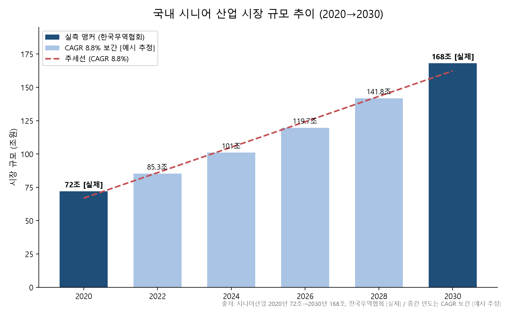

# [예시] PILLY 사업계획서 — bizplan 데모

> 이 문서는 **bizplan 스킬**로 생성한 예시 사업계획서입니다. 스킬의 실제 지침(bizplan-quick / bizplan-problem / bizplan-growth / bizplan-visual / bizplan-review)을 그대로 따라 작성했습니다.
> 통계·수치 표기 규칙: **[실제]** = 웹 검색으로 확인한 실제 데이터(출처 병기), **[예시 추정]** = 데모용 가정값(실전에서는 1차 근거로 검증 필요).
> 양식 가정: **2026 학생창업유망팀300+(U300) PSST 구조**. 팀·인물은 모두 가상이며 실존 대학·인물이 아닙니다.

---

## 0. 사업 아이템 개요

| 항목 | 내용 |
|------|------|
| **팀명** | 필리랩(PILLY Lab) — 가상 대학생 창업팀 |
| **아이템명** | **PILLY** — 독거 어르신용 AI 복약관리 스마트 약통 + 보호자·지자체 연동 서비스 |
| **한 줄 소개** | 스마트폰 없이도 쓰는 **약 자동 분배·복용 감지** 약통으로, 미복용을 실시간 감지해 **보호자·지자체에 알린다** |
| **사업 범주** | 헬스케어 하드웨어(IoT 디바이스) + 돌봄 SaaS(B2G/B2C) |
| **핵심 고객** | ① 만성질환 독거 어르신(사용자) ② 원거리 보호자(결제자) ③ 지자체 노인돌봄 부서(B2G) |
| **창업 목표** | 8개월 내 시제품 완성 + 지자체 1곳 PoC(파일럿 50대) 완료 → 3년 내 20개 지자체·1만 대 보급 |
| **한 줄 차별점** | 기존 알림앱(스마트폰 의존)과 달리 **폰 없이 사용** + 자가보고가 아닌 **복용 "감지" 실데이터** |

---

## 1. 문제 인식 (Problem)

> **작성 원칙(bizplan-problem):** SPIN 구조(Situation→Problem→Implication→Need-payoff)로 전개하고, 여기서 정의하는 문제 3개는 2장 솔루션 기능 3개와 **1:1로 대응**한다(고아 문제 금지). 상세 대응표는 **부록 A**.

### 1-1. 배경·동기 (Situation)

- **[실제] 대한민국은 2025년 초고령사회 진입.** 65세 이상 고령인구는 **993만 8천 명(전체 인구의 19.2%)**, 2025년 20%·2036년 30% 돌파 전망 (통계청, 2024 고령자통계).
- **[실제] 독거노인 급증.** 65세 이상 중 혼자 사는 비율은 **23.7%**(2000년 16.2% → 2024년 23.7%). 65세 이상 993.8만 명에 적용하면 **독거노인 약 235만 명**(993.8만 × 23.7%, [실제] 통계 기반 계산) (통계청·국가지표체계).
- **[실제] 독거 어르신은 만성질환·다제복용 집단.** 노인의 약 **90%가 1개 이상 만성질환**, **70%가 2개 이상 복합이환**(한국보건사회연구원, ARMS-K 연구 인용).
- **[실제] 그런데 이들은 스마트폰 기반 복약관리에서 소외.** 2023년 혼자 사는 고령자의 **18.7%는 도움받을 수 있는 사람이 없음**(통계청, 2023). 스마트폰 앱 복약알림은 이 집단에 도달하지 못한다.

### 1-2. 고객 Pain Point (Problem — 문제 3가지)

| # | Pain Point (문제) | 근거 | 빈도·심각도 |
|---|-------------------|------|-------------|
| **P1** | **디지털 소외** — 독거 어르신은 스마트폰 앱 복약알림을 쓰지 못해 **복용 시간·용량을 놓친다** | 앱 UX가 고령자 비친화, 폰 미소지·미숙 | 만성질환자 **약 50%가 처방대로 복용 안 함**(WHO 자주 인용, 해외) |
| **P2** | **복용 여부 확인 불가** — "먹었다"는 **자가보고가 부정확**해 보호자·돌봄기관이 실제 복용을 확인할 수 없다 | 다제복용 노인 복약순응도 실측 시 **64.3%**(해외 polypharmacy 연구) | 자가보고와 실측 간 괴리로 **관리 의사결정 왜곡** |
| **P3** | **이상징후 대응 지연** — 원거리 보호자·지자체가 **연속 미복용 같은 위험신호를 뒤늦게** 알아 대응이 늦다 | 저순응군 재입원율 **20% vs 고순응군 9%**(해외) | 방치 시 응급·건강악화로 직결 |

### 1-3. 기존 솔루션의 한계

- **한계 1 — 스마트폰 앱(Medisafe·MyTherapy 등):** 어르신이 **폰을 다뤄야** 작동. 독거·고령 집단에 도달 실패. (→ P1)
- **한계 2 — 단순 요일별 약통·알람시계:** 알림만 있고 **복용 여부를 감지·기록하지 못함**. 데이터가 남지 않는다. (→ P2)
- **한계 3 — 해외 스마트 디스펜서(MedMinder·Hero 등):** 감지·알림은 있으나 **국내 지자체 돌봄체계와 미연동**, 고가·영문 UX. (→ P3)

### 1-4. 파급 효과 및 필요성 (Implication → Need-payoff)

- **[실제] 개인적 손실:** 복약 미순응은 만성질환 악화·재입원으로 직결. 미국에서는 복약 미순응이 **입원의 약 25%에 기여**하고 연 **$100B~$289B의 회피가능 비용** 발생(해외). 국내에서도 유사한 사회적 비용이 발생하나 정량 집계는 [예시 추정].
- **[실제] 사회적 손실·정책 타이밍:** 정부는 이미 **독거노인·장애인 응급안전안심서비스**(ICT 기반 화재·응급·낙상 감지)와 **노인맞춤돌봄서비스**를 운영 중(보건복지부). 그러나 이들 서비스는 **복약(복용)이라는 일상 건강데이터를 다루지 않는다** → **PILLY가 채울 정책 공백**이 명확하다.
- **필요성:** 폰 없이 쓰고(P1), 실제 복용을 감지해 데이터로 남기며(P2), 이상징후를 실시간 에스컬레이션(P3)하는 기기가 필요하다. 이 3가지가 **2장 솔루션 3기능과 정확히 대응**한다.

### 1-5. 목표시장 분석 (요약 — 상세 산정은 부록 B)

- **TAM:** 국내 **시니어 헬스케어 시장** — [실제] 국내 시니어 산업 **2020년 72조 → 2030년 168조**(한국무역협회, CAGR 약 8.8% [실제 계산]) 중 헬스케어·디지털돌봄 부문 **약 33.6조** [예시 추정].
- **SAM:** **독거 + 만성질환 어르신 복약관리** 세그먼트 — 약 212만 명 × 연 40만 원 = **약 8,500억 원/년**([실제] 모수 기반 + [예시 추정] 단가).
- **SOM:** 초기 3년 **지자체 시범사업** 확보 목표 — 20개 지자체·1만 대 → **연 반복매출(ARR) 약 43억 원**(SAM의 약 0.5%, 보수적) [예시 추정].

---

## 2. 실현 가능성 (Solution)

> **문제-솔루션 1:1(bizplan-problem 원칙):** 아래 3기능은 각각 P1·P2·P3을 닫는다. 문제 근거 없는 기능(고아 솔루션)은 넣지 않았으며, 근거가 약한 항목은 "부가 편익"으로 격하했다.

### 2-1. 핵심 기능 3가지 (솔루션)

| # | 핵심 기능 | 해결하는 문제 | 작동 방식 |
|---|-----------|:---:|-----------|
| **S1** | **폰 없이 쓰는 오프라인 스마트 약통** — 시간별 약 자동 분배 + **음성·불빛·큰버튼** 알림 | **P1** | 어르신은 폰·앱 불필요. 통신(LTE-M)은 기기에 내장, 알림 시 배출구 개방 |
| **S2** | **복용 "감지" 센서** — 약 배출·인출을 물리적으로 감지해 **실제 복용 이벤트를 실측 기록** | **P2** | 무게·광학 센서로 트레이 인출 감지 → 자가보고가 아닌 **실데이터** 생성 |
| **S3** | **미복용 실시간 알림 + 지자체 돌봄 대시보드** — 연속 미복용을 이상징후로 자동 에스컬레이션 | **P3** | 미복용 N회 시 보호자 앱 푸시 + 지자체 대시보드 경보 |

- **부가 편익(문제 근거는 약하나 향후 가치):** 복약 실데이터 축적 → 복약 패턴 리포트·건강 이상 조기징후 분석. **초기 사업 범위 밖의 확장 편익으로 명확히 격하**(고아 솔루션화 방지).

### 2-2. 개발 로드맵 (8개월)

| 월 | 마일스톤 | 산출물 | 검증 게이트 |
|----|----------|--------|-------------|
| M1–2 | HW 프로토타입: 약 분배 기구 + 복용감지 센서 회로 | 1차 목업, 회로 설계도 | 배출·감지 정확도 벤치테스트 |
| M3–4 | 펌웨어·통신(LTE-M) + 보호자 앱 MVP + 지자체 대시보드 MVP | 3종 SW MVP | 미복용→알림 E2E 동작 확인 |
| M5 | **식약처 의료기기 해당여부 사전검토** + 어르신 10명 필드테스트 | 규제 검토서, UX 개선안 | **규제 게이트(아래 2-4)** |
| M6 | **지자체 1곳 PoC(파일럿 50대)** | PoC 계약·설치 | 현장 실데이터 확보 |
| M7 | 데이터 분석·UX 개선, 배터리·내구성 보완 | 신뢰성 리포트 | 오작동률 목표 미달 시 반복 |
| M8 | 양산 설계(DFM) + **전파(KC)·전기안전 인증 준비** | 양산 도면, 인증 준비서 | 사업화 성과 정리 |

### 2-3. 시장·경쟁 분석

**포지셔닝맵 (2축 선정 근거: 이 시장의 실패요인이 X·Y축이다)**
- **X축 — 어르신 독립 사용성**(폰 의존 ↔ 폰 불필요): 독거·고령 도달의 핵심.
- **Y축 — 데이터 신뢰성**(자가보고 ↔ 센서 실측): 돌봄 의사결정의 근거.

| 제품 | X: 폰 없이 사용 | Y: 복용 실측 | 국내 지자체 연동 |
|------|:---:|:---:|:---:|
| 스마트폰 앱(Medisafe·MyTherapy) | X | X | X |
| 요일별 약통·알람시계 | O | X | X |
| 해외 디스펜서(MedMinder·Hero) | O | O | X |
| **PILLY** | **O** | **O** | **O** |

- **차별성:** PILLY만이 **폰 불필요 + 복용 실측 + 국내 지자체 대시보드 연동** 3가지를 동시 충족. 우상단 독점.

### 2-4. 분야 필수 게이트 — 의료기기 규제(식약처)

- **[실제] 판단 기준:** 단순 **복약 알림·분배 보조**는 통상 의료기기 **비해당**(일반 공산품/IoT). 그러나 복용 데이터를 **질병 진단·치료·관리 목적**으로 해석·제공하면 **의료기기(SaMD) 해당** 가능.
- **대응 전략:** ① 초기 출시는 **비의료기기 "복약 보조·알림" 포지션**으로 규제 리스크 최소화 → ② M5에 **식약처 사전 상담(해당여부 확인)** → ③ 데이터 분석 고도화 단계에서 재검토.
- **필수 인증(비의료기기라도 해당):** **전파적합성(KC)**, **전기용품 안전인증**은 판매 전 필수 게이트. 로드맵 M8에 배치.

### 2-5. 기 확보 산출물 현황 (실적물)

> bizplan-review 체크: 초기 팀은 실적을 앵커로 방어한다. 아래는 [예시 추정] 데모 산출물.

| 산출물 | 현황 | 용도 |
|--------|------|------|
| **랜딩페이지** | 제작 완료(제품 소개·보호자 사전신청 폼) [예시 추정] | B2C 수요 검증, 사전신청 리드 확보 |
| **1차 목업 시제품** | 3D 프린팅 외형 + 감지 센서 브레드보드 [예시 추정] | 지자체·투자자 데모 |
| **인스타그램/블로그** | 돌봄 콘텐츠 운영 [예시 추정] | 보호자 커뮤니티 초기 접점 |
| **지자체 협의 기록** | 노인복지과 담당자 인터뷰 2건 [예시 추정] | 문제·니즈 1차 근거(현장 검증) |

---

## 3. 성장 전략 (Scale-up)

> **작성 원칙(bizplan-growth):** BM은 문제·솔루션과 연결하고, 매출은 하부 가정(대수×단가×전환)으로 분해한다. 자금은 확보/목표를 구분한다.

### 3-1. 비즈니스 모델 (BM 캔버스 요약)

| 구성 요소 | 내용 |
|-----------|------|
| **가치 제안** | 폰 없이 쓰는 복약관리 + 복용 실데이터 + 보호자·지자체 안심 알림 |
| **고객 세그먼트** | 만성질환 독거 어르신(사용자) / 원거리 보호자(결제자) / 지자체 돌봄부서(B2G 구매자) |
| **채널** | B2G(지자체 조달·시범사업) → 레퍼런스 → B2C(보호자 직접구독) |
| **수익원** | ① HW 판매 ② 관제 SaaS 구독 ③ 보호자 프리미엄 구독 |
| **핵심 자원** | 감지 센서·펌웨어 IP, 지자체 레퍼런스, 복약 데이터셋 |
| **핵심 파트너** | 지자체 노인돌봄부서, 노인복지관, 통신모듈 공급사, 약국 협회 [예시 추정] |
| **비용 구조** | (고정) 개발 인건비·인증비 / (변동) HW 제조원가·통신비·CS |

### 3-2. 수익 모델·가격 전략

| 수익원 | 과금 방식 | 단가 [예시 추정] | 예상 비중 |
|--------|-----------|------------------|:---:|
| **HW 판매(B2G 조달)** | 대당 1회 | **30만 원/대** | 40% |
| **관제 SaaS(B2G)** | 대당 월정액 | **월 3만 원/대** | 45% |
| **보호자 프리미엄(B2C)** | 계정 구독 | **월 9,900원** | 15% |

- **가격 근거:** 해외 디스펜서 대여가(월 $40~$70) 대비 저가 진입 + 지자체 조달 단가 수용범위. **실전에서는 지자체 조달 예가·원가표로 재산정 필요.**

### 3-3. 시장 진입 전략 (마케팅)

- **초기(0–6개월):** ① **지자체 PoC 앵커** — 노인맞춤돌봄·응급안전안심 연계 시범사업 1곳. ② 보호자 랜딩페이지 사전신청 리드 확보.
- **성장기(6–12개월):** ① PoC 성과 레퍼런스로 **인접 지자체 확산**. ② 노인복지관·약국 채널 제휴로 B2C 유입.

### 3-4. 단기·중기·장기 목표

| 구분 | 목표 | 전략 | 핵심 지표(KPI) |
|------|------|------|----------------|
| 단기(1년) | 지자체 1곳 PoC + 500대 보급 | B2G 앵커, 실데이터 확보 | 오작동률 <3%, 복용감지 정확도 >95% |
| 중기(2–3년) | **20개 지자체·1만 대** | 레퍼런스 확산, SaaS 반복매출 | ARR 약 43억, 재계약률 >80% |
| 장기(5년) | 전국 확산 + B2C 병행, 데이터 사업 | 채널 다각화, 건강분석 확장 | 누적 5만 대, 흑자 전환 |

### 3-5. SWOT (요약)

|  | 긍정적 | 부정적 |
|--|--------|--------|
| **내부** | (S) 폰 불필요 UX·복용 실측·B2G 연동 독점 조합 | (W) 초기 HW 제조·인증 리드타임, 매출 실적 부재 |
| **외부** | (O) 초고령사회·정부 돌봄예산 확대 | (T) 대기업/해외기업 진입, 의료기기 규제 불확실성 |

- **SO:** 정책 예산 확대기에 B2G 앵커로 선점. **WT:** 규제는 비의료기기 포지션+식약처 사전상담으로 방어(2-4).

### 3-6. 자금 계획 (8개월, U300 지원금 가정)

> **[실제] 주의:** U300 지원금 규모는 연도별 공고에 따라 다르다. 아래 총액은 [예시 추정]이며, **실전에서는 공고문 지원금·집행기준을 확인해 항목을 조정**해야 한다.

| 항목 | 배분 [예시 추정] | 비중 |
|------|------------------|:---:|
| HW 시제품·금형·부품 | 1,800만 원 | 36% |
| SW 개발(외주·클라우드) | 1,200만 원 | 24% |
| 인증·규제 대응(KC·식약처 상담) | 700만 원 | 14% |
| 필드테스트·PoC 운영 | 800만 원 | 16% |
| 마케팅·지재권 | 500만 원 | 10% |
| **합계** | **5,000만 원** | 100% |

- **확보:** U300 지원금(가정) 5,000만 원. **목표(미확보):** 후속 시드 투자·지자체 매칭 예산은 PoC 성과 뒤 추진(확보 아님, 명확 구분).

---

## 4. 팀 구성 (Team)

> **작성 원칙(case-insights):** 아이템의 핵심 리스크와 이를 책임질 팀원 역량을 매핑한다. 실명 대학·인물은 기재하지 않는다.

### 4-1. 대표자 역량

- **대표 A** — 산업디자인 전공(가상). 시니어 제품 UX·사용자 리서치 경험. **고령자 비친화 UX(P1)** 해결의 핵심 담당. 현장 인터뷰·PoC 운영 총괄.

### 4-2. 팀 구성표 및 리스크 매핑

| 역할 | 전공(가상) | 담당 | **연결되는 핵심 리스크** |
|------|-----------|------|--------------------------|
| 대표 A | 산업디자인 | 제품 UX·사업 총괄 | 고령자 사용성(P1) |
| CTO B | 전자공학(임베디드/IoT) | HW·센서·펌웨어 | **하드웨어 신뢰성·복용 감지 정확도(S2)** |
| 개발 C | 컴퓨터공학 | 백엔드·앱·대시보드 | 데이터 파이프라인·알림 안정성(S3) |
| BD D | 사회복지학 | 지자체 채널·B2G 영업 | **지자체 조달·돌봄체계 연동 리스크** |
| 자문 | (외부) 규제·약무 자문 [예시 추정] | 식약처 해당여부·인증 | **의료기기 규제 리스크(2-4)** |

- **정합성:** 아이템 3대 리스크(**HW 신뢰성 / B2G 채널 / 규제**)가 각각 CTO·BD·자문에 매핑됨. 핵심 기술을 1인에 의존하지 않도록 CTO+개발 이원화.

### 4-3. 협력기관 (계획)

| 기관 유형 | 협업 단계 [예시 추정] | 역할 |
|-----------|----------------------|------|
| 기초지자체 노인복지과 | 협의 중 → PoC MOU 목표 | 시범사업·대상자 연계 |
| 노인복지관 | 인터뷰 완료 | 필드테스트 대상 모집 |
| 통신모듈 공급사 | 견적 확보 [예시 추정] | LTE-M 모듈 공급 |

---

## 부록 A. 문제-솔루션 1:1 대응표

> bizplan-problem·bizplan-review 핵심 점검: 고아 문제(대응 솔루션 없음)·고아 솔루션(문제 근거 없음)이 없어야 한다.

| 문제 (P) | 대응 솔루션 요소 (S) | 규모 정합 | 상태 |
|----------|----------------------|-----------|------|
| **P1** 디지털 소외(폰 못 씀) | **S1** 폰 없이 쓰는 오프라인 스마트 약통 | 독거 235만 ↔ 기기 1:1 보급 | **대응됨** |
| **P2** 복용 여부 확인 불가(자가보고 부정확) | **S2** 복용 감지 센서(실측 데이터) | 복용 이벤트 단위 실측 | **대응됨** |
| **P3** 이상징후 대응 지연 | **S3** 미복용 실시간 알림 + 지자체 대시보드 | 연속 미복용→자동 경보 | **대응됨** |
| (참고) 복약 데이터 분석·건강 조기징후 | 부가 편익(초기 범위 밖) | — | **부가 편익으로 격하**(고아 솔루션 아님) |

- **점검 결과:** 고아 문제 **0건**, 고아 솔루션 **0건**. P1·P2·P3 ↔ S1·S2·S3 완전 1:1. 부가 기능은 "편익"으로 명시 격하.

---

## 부록 B. TAM / SAM / SOM 산정

> bizplan-visual 원칙: 각 층위에 **정의 + 산출식 + 출처**를 병기. 하향식(TAM)·상향식(SAM·SOM) 병행. TAM만 크게 쓰고 SOM 로직이 없으면 감점.

| 층위 | 정의 | 산출식 | 값 | 출처·근거 |
|------|------|--------|-----|-----------|
| **TAM** | 국내 시니어 헬스케어 시장(하향식) | 시니어 산업 168조(2030) × 헬스케어 비중 20% | **약 33.6조 원** | [실제] 시니어 산업 72조(2020)→168조(2030), 한국무역협회 / 비중 20%는 [예시 추정] |
| **SAM** | 독거+만성질환 어르신 복약관리(상향식) | (993.8만 × 23.7% × 90%) × 연 40만 원 | **약 8,500억 원/년** | [실제] 65세 993.8만·독거 23.7%(통계청)·만성질환 90%(KIHASA) / 단가 40만 원 [예시 추정] |
| **SOM** | 초기 3년 지자체 시범사업 확보(상향식) | 20개 지자체 × 500대 = 1만 대 → SaaS 36억(1만 × 36만/년) + B2C 약 7억(1만 가구 × 전환 60% × 연 11.88만) | **연 반복매출(ARR) 약 43억 원** (+ HW 초기 보급 30억은 일시성, 별도) | [예시 추정] 목표 지자체·보급대수·전환율. 228개 시군구 중 8.8% |

**산정 로직 설명**
- **하향식(TAM):** 공신력 통계(시니어 산업 규모)에서 헬스케어 부문으로 세분화. 비중 20%는 추정이므로 실전 검증 필요.
- **상향식(SAM):** 독거노인 모수 → 만성질환 필터 → 세그먼트 인구(약 212만 명) × 연 지불액. **모수는 실제 통계, 단가만 추정.**
- **상향식(SOM):** 확보 가능한 지자체·대수로 바텀업 산정. 반복매출(SaaS+B2C)만 SOM에 계상하고 일시성 HW 매출은 분리. **SOM/SAM = 약 0.5%로 보수적**(TAM 과시·낙관 회피, case-insights 반영).
- **SOM 실증 근거(실전 권장):** 지자체 PoC 계약·구매의향서(LOI)·파일럿 데이터로 목표 점유율을 뒷받침해야 신뢰를 얻는다.

---

## 부록 C. 시각자료 배치 구성안 (bizplan-visual 진단표)

> "시각자료 1개 = 핵심 메시지 1개". 각 자료의 **의도**를 명시(사용자 지정 체크포인트 2).

| 섹션 | 현재 상태 | 제안 자료 | 이 자료의 의도 | 핵심 메시지 | 제작 방법 | 함께 넣을 증빙 |
|------|-----------|-----------|----------------|-------------|-----------|----------------|
| 1. 문제인식 | 텍스트+표 | 독거노인 추이 막대그래프 | 문제의 성장성·타이밍 각인 | "독거노인 235만, 계속 증가" | matplotlib(한글폰트) | 통계청 캡처·출처 |
| 1. 문제인식 | 텍스트 | 문제-솔루션 1:1 대응 도식 | 정리된 팀임을 10초에 증명 | "3문제 ↔ 3기능 완전 대응" | 냅킨AI/PPT 화살표 | 부록 A |
| 2. 실현가능성 | 표 | 포지셔닝맵(2축) | 차별성 시각 독점 증명 | "우상단 독점(폰불필요×실측)" | PPT 2×2 | 경쟁사 스펙 캡처 |
| 2. 실현가능성 | 표 | 8개월 간트차트 | 실행 가능성·게이트 신뢰 | "M6 지자체 PoC 도달" | PPT 간트 | 통신사 견적서 |
| 2. 실현가능성 | 텍스트 | 시제품·감지 원리 도해 | 기술이 실재함을 증명 | "센서로 복용 실측" | 목업 사진+도면 | 시제품 사진 |
| 3. 성장전략 | 표 | BM 구성도(가치·수익 흐름) | 수익 구조 직관화 | "HW+SaaS 반복매출" | 냅킨AI 플로우 | LOI·조달 예가 |
| 부록 B | 표 | TAM/SAM/SOM 동심원 | 시장을 좁혀 접근함을 증명 | "SOM ARR 43억, 보수적" | matplotlib 동심원 | 구매의향서 |

**아래는 실제로 생성한 예시:** (제작 스크립트는 `visuals/*.py`, 검토 예시는 `예시-검토리포트-PILLY.md`)

---

## 부록 D. 자체 검토 결과 (bizplan-review 기준)

> **평가 배점 가정(U300):** 문제인식 20 / 실현가능성 30 / 성장전략 30 / 팀 20 = 100점(+ 발표평가 별도). **[실제] 주의:** 이는 데모용 가정 배점이다. **실전에서는 공고문 배점표를 반드시 확보해 각 배점 항목에 본문을 매핑하라.**

### D-1. 종합 평가
- **점수: 82 / 100** (문제인식 17 / 실현가능성 25 / 성장전략 24 / 팀 16) — 데모 자가채점.
- **합격 가능성: 중상(서류 통과권).** 문제-솔루션 정합성·규제 인지·보수적 SOM이 강점. 실증 데이터·확정 실적이 채워지면 상위권.

### D-2. 강점 3가지
1. **문제-솔루션 완전 1:1 대응**(부록 A) — 고아 문제·솔루션 0건, "정리된 팀" 인상.
2. **1차 근거 지향** — 거시 통계에 더해 현장 인터뷰·지자체 협의·규제 조항으로 문제를 특정.
3. **분야 필수 게이트(식약처·KC) 선제 인지** — 규제 무지형 감점 회피, 팀 성숙도 신호.

### D-3. 약점 및 개선점 3가지

| 약점 | 개선 방안 |
|------|-----------|
| 단가·시장 수치가 다수 [예시 추정] | 지자체 조달 예가·원가표·구매의향서로 1차 근거 확보 |
| 매출 실적·확정 계약 부재 | PoC MOU·LOI를 로드맵 최우선에 배치, "목표/확보" 구분 유지 |
| 복용 감지 정확도 미검증 | M1–2 벤치테스트 수치화, 3자 시험 경로 확보 |

### D-4. 데이터 신뢰도 검증 (핵심 항목)

| 데이터 | 출처 | 신뢰도 | 권장 |
|--------|------|--------|------|
| 독거노인 235만, 만성질환 90% | 통계청·KIHASA | **높음** | 발표 슬라이드에 출처 명기 |
| 미순응 비용·재입원율 | 해외 연구 | 보통 | 국내 건보공단 데이터로 보강 |
| 단가 40만·SOM ARR 43억 | [예시 추정] | 낮음 | 조달 예가·PoC 실측으로 대체 |

### D-5. 발표 시 예상 질문 5 (약점 방어 포함)

1. "복용을 실제로 감지한다는데 **정확도 근거**는?" → M1–2 벤치테스트·3자 시험 계획으로 방어.
2. **(약점 방어)** "**매출·계약 실적이 없는데** 시장성을 어떻게 증명하나?" → 지자체 PoC 계약·보호자 사전신청 리드를 앵커로 제시.
3. **(약점 방어)** "**의료기기 규제**에 걸리면 사업이 멈추지 않나?" → 비의료기기 포지션+식약처 사전상담(M5)으로 리스크 관리.
4. "해외 MedMinder·Hero와 **무엇이 다른가**?" → 폰 불필요×실측×지자체 연동 3중 차별(포지셔닝맵).
5. "SOM ARR 43억이 **너무 작지 않나**?" → 초기 보수적 목표(SAM의 약 0.5%), 확장은 중장기 KPI로 제시.

### D-6. 사용자 지정 8대 체크포인트 점검

| # | 체크포인트 | 충족 | 근거(한 줄) |
|---|-----------|:---:|-------------|
| 1 | 문제인식 명확 + 솔루션 1:1 해결 | **O** | 부록 A에서 P1·P2·P3 ↔ S1·S2·S3 완전 대응, 고아 0건 |
| 2 | 각 시각자료의 의도 명확 | **O** | 부록 C에 "이 자료의 의도" 열로 자료별 목적 명시 |
| 3 | 공식 평가 배점표 확보·매핑 | **△** | U300 배점 가정+본문 매핑, 단 실전 공고문 배점표 확보는 미완(주석 명시) |
| 4 | 경쟁사 분석·차별성 명확 | **O** | 2-3 포지셔닝맵으로 4개 경쟁군 대비 우상단 독점 |
| 5 | 장점 부각 + 약점 보완 답변 | **O** | D-2 강점 + D-5 약점 방어 질문(2·3번) 준비 |
| 6 | 만들어 둔 산출물(실적물) | **O** | 2-5에 랜딩페이지·목업·SNS·협의기록(단, [예시 추정]) |
| 7 | 필수 시각자료 배치 | **O** | 부록 C 7종(포지셔닝맵·간트·TAM/SAM/SOM 등) |
| 8 | 팀 구성 ↔ 핵심 리스크 연결 | **O** | 4-2에서 HW신뢰성·B2G·규제 리스크를 CTO·BD·자문에 매핑 |

- **미충족(△) 1건:** 항목 3 — 데모라 실제 공고문 배점표를 확보하지 못함. **실전 필수 액션: 공고문 배점표를 받아 각 배점에 본문 문단을 번호로 매핑.**

---

### 출처 (Sources)
- [통계청, 2024 고령자통계](https://kostat.go.kr/board.es?mid=a10301010000&bid=10820&act=view&list_no=432917)
- [국가지표체계, 독거노인 비율](https://www.index.go.kr/unify/idx-info.do?idxCd=8039)
- [한국보건사회연구원, 노인 복약이행도(ARMS-K) 연구](https://www.kihasa.re.kr/hswr/assets/pdf/1103/journal-39-3-215.pdf)
- [보건복지부, 노인맞춤돌봄서비스](https://www.mohw.go.kr/menu.es?mid=a10712010400)
- [보건복지부, 독거노인·장애인 응급안전안심서비스](https://www.mohw.go.kr/board.es?mid=a10503010100&bid=0027&act=view&list_no=1480948)
- [더스탁, 실버 이코노미 168조 전망(한국무역협회 인용)](https://www.the-stock.kr/news/articleView.html?idxno=19517)
- [헬스케어헤럴드, 실버테크 산업 전망](https://www.healthcareherald.co.kr/news/articleView.html?idxno=54817)
- [Duke Health, Medication Nonadherence & Readmissions](https://physicians.dukehealth.org/articles/medication-nonadherence-increases-health-costs-hospital-readmissions)
- [PMC, Multiple Medication Adherence in Older People (polypharmacy 64.3%)](https://www.ncbi.nlm.nih.gov/pmc/articles/PMC9099923/)

> ⚠️ 본 문서의 [예시 추정] 수치와 팀·산출물은 데모용 가정입니다. 실제 제출 시 1차 근거(구매의향서·조달 예가·시험성적서·공고문 배점표)로 반드시 검증·대체하십시오.
